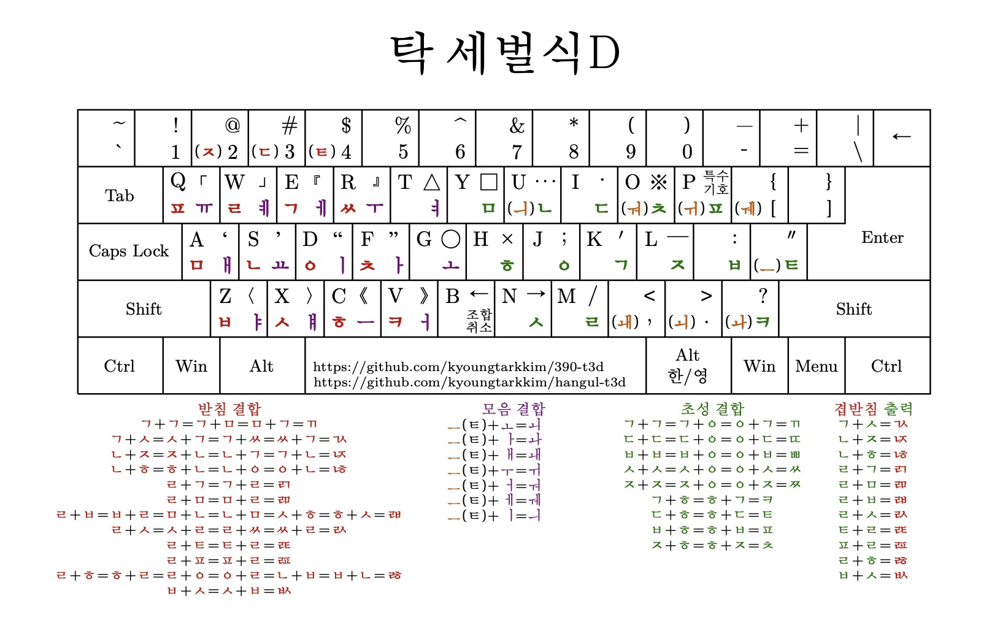

# Emacs용 탁 세벌식D 입력기

## Layout

## 탁 세벌식D 자판을 개발한 이유
취미 생활이 타자 연습인지라, 오랜 기간동안 참 신세벌식D를 사용해서 타자 연습을 하였습니다. 탁 세벌식D는 참 신세벌식D를 사용하면서 제가 느꼈던 아쉽거나 불편한 점을 개선하고, 최적의 갈마들이 신세벌식류 자판을 만들고자 오랜 시간의 연구와 타자를 거쳐 수정되어진 참 신세벌식D의 변형 결과물입니다.

## 왜 하필 이름을 탁 세벌식D 라고 지었나?
높을 탁(卓)자를 사용하여, 신세벌식류 중에서 높은 위치로 올라가길 바래서 그렇게 지었습니다. 그리고 특이한 글자니까 눈에 띌 것 같습니다.

## 특징
1. 초성 입력 방법이 참 신세벌식과 완전히 다릅니다. 세모이 Layout에서 초성 입력 방법을 가져와서 거센소리를 추가하였습니다: 세모이 초성의 거센 소리 조합 방식도 여전히 사용할 수 있습니다. (개인적으로, 초성 입력에서는 Original 공세벌식 또는 참 신세벌식보다 탁 세벌식D에서 사용하고 있는 세모이 초성의 확장 버젼이 가장 좋은 방식이라고 여기고 있습니다.)
2. 공세벌식류, 신세벌식류의 "ㅗ"와 "ㅜ"의 모음 결합 방식을 완전히 제거하고, "ㅚ","ㅘ","ㅙ","ㅟ","ㅝ","ㅞ"를 한번에 입력할 수 있도록 하였습니다. 처음에는 어색할 수 있으나 이 방법을 도입 후 오랜 시간 동안 타자 연습을 해오다 보니 이 방식이 더 우수하다는 확신올 가지고 있습니다.
3. 기존의 모음 결합도 할 수 있도록 하였습니다: 하지만, "ㅗ"와 "ㅜ"를 사용하여 조합하지 않고, 편의상 "ㅡ"만을 사용하도록 하였습니다: 즉, "ㅡ + ㅗ = ㅚ", "ㅡ + ㅏ = ㅘ", "ㅡ + ㅐ = ㅙ", "ㅡ + ㅜ = ㅟ", "ㅡ + ㅓ = ㅝ", "ㅡ + ㅔ = ㅞ", "ㅡ + ㅣ = ㅢ"로 동작합니다.
4. 모음 출력시에는 기존의 "ㅗ"와 "ㅜ"를 사용하여 복모음을 만들 수 있는 방법도 그대로 유지하였습니다: 즉, 모음만을 출력하고자 할 때에는 "ㅗ + ㅣ = ㅚ"와 같은 조합이 작동합니다.
5. 참 신세벌식D에서는 왼손 검지가 c키,v키,b키 세개를 동시에 커버해야 했기에 조금은 혼란스러웠다고 개인적으로 느꼈습니다. 탁 세벌식D에서는 b키를 어떠한 초성, 중성, 종성에도 할당하지 않고, 조합 취소키로의 역할만 하도록 부여하였습니다. 이는 조합 취소키의 역할이 중요해서라기보다는, 왼손 검지를 b키로부터 해방시키기 위함입니다. 따라서, 탁 세벌식D에서 왼손 검지는 오직 c키와 v키만 담당하면 되니 부담이 훨씬 줄어 듭니다.
6. 참 신세벌식D에서 b키는 모음 "ㅑ"에 해당합니다. 탁 세벌식D에서는 모음 "ㅑ"를 z키로 이동하였습니다.
7. 더불어, x키와 c키의 조합을 겹받침 "ㄼ"에 할당하여 모음 "ㅓ(v키)"와 "ㅑ(z키)"와의 조합에 유리하도록 추가하였습니다. 사용해 보시면 아시겠지만, 모음 "ㅑ"에 대해서는 z키의 위치가 기존의 b키의 위치보다 더 좋다는 것을 직접 느끼실 수 있습니다.
8. 참 신세벌식D에서 모음 "ㅐ"의 위치가 마음에 들지 않았습니다: 그 이유는 받침 "ㄹ"과 조합이 좋지 않고, "ㅐ + ㅅ"의 경우는 약지와 중지의 조합인데 타자하기는 어렵지 않으나, 고속 타자시 방해되는 약지와 중지의 조합이라 생각됩니다. 따라서, "ㅐ"는 a키로, "ㅛ"는 s키로 바꾸었습니다. 모음 "ㅐ"를 a키로 바꿈으로써, a키의 받침 "ㅁ"과는 조합이 나빠지지만, "ㅐ + ㅁ" 조합은 "ㅐ + ᆯ" 보다 빈도수에서 덜 나타난다고 생각합니다. "ㅐ + ㅂ(z키)"의 조합도 나빠지지만, "ㅐ + ㅂ"의 조합은 꽤 드뭅니다. 결과적으로, 모음 "ㅐ"를 a키로 이동하는 작업은 장단점이 존재합니다. 하지만, 전체적인 타자 흐름에서는 꽤 리듬감을 생기게끔 하므로 좋은 선택이라 생각합니다! (역시, 오랜시간 타자해보시면, 모음 "ㅐ"는 s키의 자리보다 a키의 자리가 더 어울린다는 것을 직접 느끼실 수 있습니다!)
9. 받침 "ㅆ"의 위치를 (기존의 참 신세벌식D에서는 q키이지만) r키로 변경하였습니다. 신세벌식류에서 r키의 자리는 받침으로 사용하기엔 의외로 매우 좋은 위치라고 생각합니다. 이로써, a키에 할당된 모음 "ㅐ"와 받침 "ㅆ"의 좋은 조합도 역시 챙길 수 있습니다. 뿐만 아니라, r키 주변의 모음에는 "ㅔ(e키)", "ㅕ(t키)", "ㅣ(d키)", "ㅏ(f키)", "ㅓ(v키)"가 존재하므로, r키가 받침 "ㅆ"으로 사용될 시, 조합이 매우 좋아집니다. 게다가, 겹받침 "ㄱ + ㅆ = ㅆ + ㄱ = ㄳ" 생성에 있어서도 훌륭한 자리이며, "몫"과 같이 "ㅗ(g키) + ㄳ"의 조합도 더더욱 좋아집니다.
10. q키에는 받침에서 뜻밖의 중요한 역할을 하는 "ㅍ"을 할당하였습니다. 참 신세벌식D에서 받침 "ㅍ"은 숫자 4키에 해당하고 이 위치도 받침 "ㅍ"의 위치로써 좋지만, q키로 옮겨감으로써 더더욱 활용성이 좋아졌습니다.
11. 겹받침 "ᆶ"에 대해서 s키와 z키를 조합해서 만들 수 있도록 입력 방법을 추가하였습니다: 따라서, 모음 "ㅣ(d키)"와의 조합이 더 좋아졌습니다.
12. 숫자 4키는 받침 "ㅌ"에 할당하였습니다. 이로써 모음 "ㅐ(a키)"와의 조합이 좋아지고, 모음 "ㅏ(f키)"의 조합도 좋아집니다.
13. 받침 "ㅊ"의 위치를 f키로 정하였습니다. 따라서, "꽃", "몇몇", "빛"과 같은 "ㅗ(g키) + ㅊ", "ㅕ(t키) + ㅊ", "ㅣ(d키) + ㅊ" 조합이 더 좋아졌습니다. (f키는 신세벌식류에서 받침의 위치로써 좋은 자리입니다!)
14. 받침 "ㅋ"의 위치를 v키로 정하였습니다. 따라서, "부엌", "케잌"과 같이 "ㅓ(v키) + ㅋ", "ㅣ(d키) + ㅋ"의 조합이 좋아집니다.
15. Shift키와 조합해서 출력할 수 있는 특수 문자 배열을 조금 조정하였습니다.

